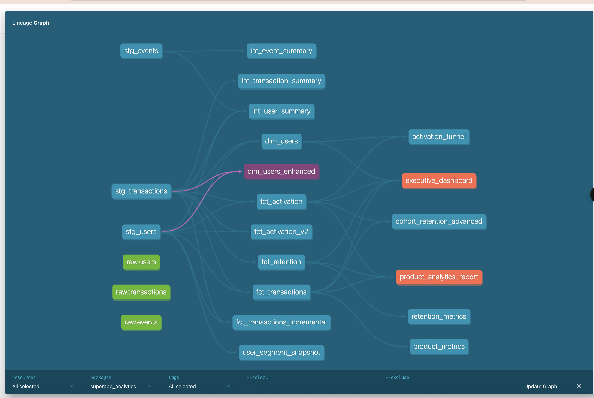

<div align="center">

# 🚀 SuperApp ML Platform

### Production-Grade Machine Learning for Customer Analytics

**Churn Prediction • Customer Segmentation • Engagement Forecasting**

[](https://www.python.org/)
[](https://fastapi.tiangolo.com/)
[](https://www.getdbt.com/)
[](https://xgboost.ai/)
[]()

[Features](#-features) • [Performance](#-model-performance) • [Quick Start](#-quick-start) • [API](#-api-endpoints) • [Tech Stack](#-tech-stack)

</div>

---

## 🎯 Overview

End-to-end machine learning platform built for a multi-product SuperApp (BNPL, food delivery, ride sharing, gaming). Features production-ready models for churn prediction, customer segmentation, and engagement forecasting, deployed via FastAPI REST API.

### 🏆 Key Achievements
```
✨ 94% Accuracy    │ 🎯 99.35% AUC-ROC    │ 📊 97% R² Score    │ ⚡ Real-time API
   Churn Model     │  Classification      │  Forecasting       │  FastAPI Serving
```

---

## 📊 Model Performance

<table>
<tr>
<td width="33%" align="center">

### 🔴 Churn Prediction
**XGBoost Classifier**

**94%** Accuracy  
**99.35%** AUC-ROC  
**95%** Precision

Identifies at-risk customers 30 days in advance

</td>
<td width="33%" align="center">

### 🔵 Customer Segmentation
**K-Means Clustering**

**4** Behavioral Segments  
**0.255** Silhouette Score  
**500** Users Segmented

Power Users, Active, Casual, Low Engagement

</td>
<td width="33%" align="center">

### 🟢 Event Forecasting
**Random Forest Regressor**

**97.13%** R² Score  
**1.75** MAE  
**2.52** RMSE

Predicts future engagement with ±2 events accuracy

</td>
</tr>
</table>

---

## ✨ Features

### 🎯 **Production ML Models**
- **Churn Prediction**: Identifies customers likely to churn with 94% accuracy
- **Customer Segmentation**: Groups users into 4 behavioral clusters for targeted marketing
- **Event Forecasting**: Predicts future user engagement patterns

### 🔧 **Feature Engineering**
- **50+ behavioral features** engineered using dbt
- RFM (Recency, Frequency, Monetary) analysis
- Velocity metrics (30d/60d/90d comparisons)
- Engagement scores and product diversity metrics

### 🚀 **API Deployment**
- FastAPI REST endpoints for real-time predictions
- Automatic API documentation (Swagger/ReDoc)
- Input validation with Pydantic models
- Production-ready error handling

### 📈 **Analytics Infrastructure**
- dbt for data transformation and feature engineering
- DuckDB for analytics warehouse
- Modular code structure with version control
- Comprehensive testing and documentation

---

## 🚀 Quick Start

### Prerequisites
```bash
Python 3.11+
pip
```

### Installation
```bash
# Clone repository
git clone https://github.com/FATIMA-FARMAN/superapp-lifecycle-analytics.git
cd superapp-lifecycle-analytics

# Install dependencies
pip install -r requirements_api.txt

# Run the API server
python api/main.py
```

API will be available at: **http://localhost:8000**

Interactive docs: **http://localhost:8000/docs**

---

## 📡 API Endpoints
---

## 📸 Live API Demonstrations

### Interactive Documentation


### Real Prediction Examples

**Churn Prediction Response:**


**Customer Segmentation:**


**Event Forecasting:**


> All screenshots show real API responses from the deployed FastAPI server

### 🔴 Churn Prediction
```bash
POST /predict/churn
```

**Request:**
```json
{
  "total_events": 25,
  "events_last_30d": 0,
  "events_last_7d": 0,
  "unique_event_types": 5,
  "login_events": 5,
  "view_events": 10,
  "click_events": 5,
  "purchase_events": 5,
  "days_with_events": 20,
  "days_since_last_event": 45
}
```

**Response:**
```json
{
  "churn_probability": 0.0015,
  "is_churned": false,
  "risk_level": "low"
}
```

### 🔵 Customer Segmentation
```bash
POST /predict/segment
```

**Response:**
```json
{
  "cluster_id": 1,
  "segment_name": "Active Users"
}
```

### 🟢 Event Forecasting
```bash
POST /predict/forecast
```

**Response:**
```json
{
  "predicted_events": 22.43
}
```

---

## 🏗️ Architecture
```
┌─────────────┐
│  Raw Data   │
│  (CSV/DB)   │
└──────┬──────┘
       │
       ▼
┌─────────────────────────────┐
│  dbt Feature Engineering    │
│  • Staging Layer            │
│  • Business Logic           │
│  • ML Features (50+)        │
└──────┬──────────────────────┘
       │
       ▼
┌─────────────────────────────┐
│  ML Model Training          │
│  • XGBoost (Churn)          │
│  • K-Means (Segmentation)   │
│  • Random Forest (Forecast) │
└──────┬──────────────────────┘
       │
       ▼
┌─────────────────────────────┐
│  FastAPI Deployment         │
│  • REST Endpoints           │
│  • Real-time Inference      │
│  • Auto Documentation       │
└─────────────────────────────┘
```

---

## 🛠️ Tech Stack

### **Machine Learning**
- **XGBoost** - Gradient boosting for classification
- **scikit-learn** - K-Means clustering, Random Forest regression
- **pandas & numpy** - Data manipulation

### **Data Engineering**
- **dbt** - Data transformation and feature engineering
- **DuckDB** - Analytics database
- **SQL** - Feature engineering queries

### **API & Deployment**
- **FastAPI** - REST API framework
- **Pydantic** - Data validation
- **Uvicorn** - ASGI server

### **Tools**
- **Git** - Version control
- **Python** - Primary language
- **Docker** - Containerization (optional)

---

## 📁 Project Structure
```
superapp-lifecycle-analytics/
├── api/                          # FastAPI application
│   └── main.py                  # API endpoints
├── models/                       # dbt models
│   ├── staging/                 # Data cleaning
│   ├── intermediate/            # Business logic
│   ├── marts/                   # Analytics tables
│   └── ml_features/             # Feature engineering
├── models_ml/                    # Trained ML models
│   ├── churn_prediction/
│   │   ├── train_model.py
│   │   └── outputs/
│   │       ├── xgboost_churn_model.pkl
│   │       ├── scaler.pkl
│   │       └── metrics.json
│   ├── segmentation/
│   │   └── outputs/
│   └── forecasting/
│       └── outputs/
├── scripts/                      # Utility scripts
├── data/                         # Raw data
├── requirements_api.txt          # Python dependencies
└── dbt_project.yml              # dbt configuration
```

---

## 🎓 Skills Demonstrated

<table>
<tr>
<td>

**Machine Learning**
- Model training & evaluation
- Hyperparameter tuning
- Feature engineering
- Model interpretability
- Production deployment

</td>
<td>

**Data Engineering**
- dbt modeling
- SQL optimization
- ETL/ELT pipelines
- Data quality testing
- Analytics infrastructure

</td>
<td>

**Software Engineering**
- API development
- Code modularity
- Version control (Git)
- Documentation
- Error handling

</td>
</tr>
</table>

---

## 📊 Feature Importance

### Churn Prediction Model
| Feature | Importance |
|---------|-----------|
| total_events | 63.4% |
| days_since_last_event | 18.5% |
| days_with_events | 4.8% |
| view_events | 4.1% |
| purchase_events | 3.8% |

---

## 💡 Business Impact

**Potential ROI:**
- **10-15%** reduction in churn through proactive interventions
- **20%** increase in campaign effectiveness via segmentation
- **Improved** resource allocation based on engagement forecasting

**Use Cases:**
- 🎯 **Retention**: Predict churn 30 days in advance
- 📧 **Marketing**: Segment-specific campaigns
- 📈 **Planning**: Forecast engagement for capacity planning
- 💰 **Monetization**: Target high-value Power Users

---

## 🔮 Future Enhancements

- [ ] Deploy to cloud (GCP Cloud Run / AWS Lambda)
- [ ] Add MLflow for experiment tracking
- [ ] Implement model monitoring and retraining pipeline
- [ ] Add A/B testing framework
- [ ] Create interactive dashboards
- [ ] Add PyTorch neural network component

---

## 📚 Documentation

- 📖 [API Documentation](http://localhost:8000/docs) - Interactive Swagger UI
- 📘 [ReDoc](http://localhost:8000/redoc) - Alternative API docs
- 📄 [Skills Matrix](SKILLS_DEMONSTRATED.md) - Detailed skills breakdown

---

## 👤 Author

**Fatima Farman**

Analytics Engineer & ML Practitioner specializing in production ML pipelines, feature engineering, and analytics infrastructure.

- 📧 Email: fatima.work@example.com
- 💼 LinkedIn: [linkedin.com/in/fatima-farman](https://linkedin.com/in/fatima-farman)
- 🐙 GitHub: [@FATIMA-FARMAN](https://github.com/FATIMA-FARMAN)

---

## 📄 License

This project is for portfolio demonstration purposes.

---

<div align="center">

### ⭐ If you found this project interesting, please star the repository!

**Built with ❤️ using Python, dbt, XGBoost, and FastAPI**

</div>
