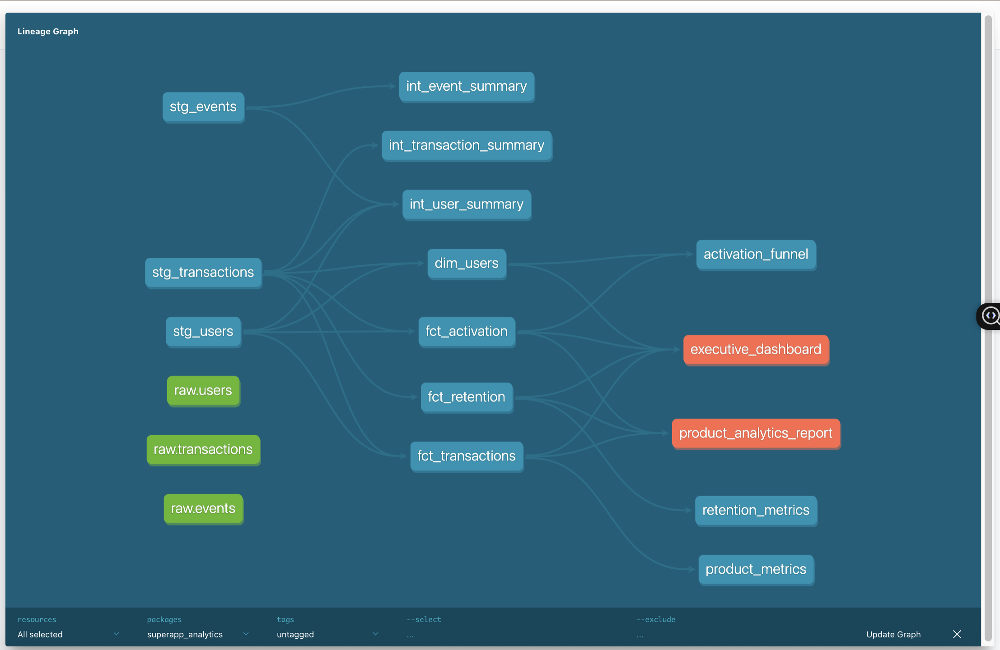
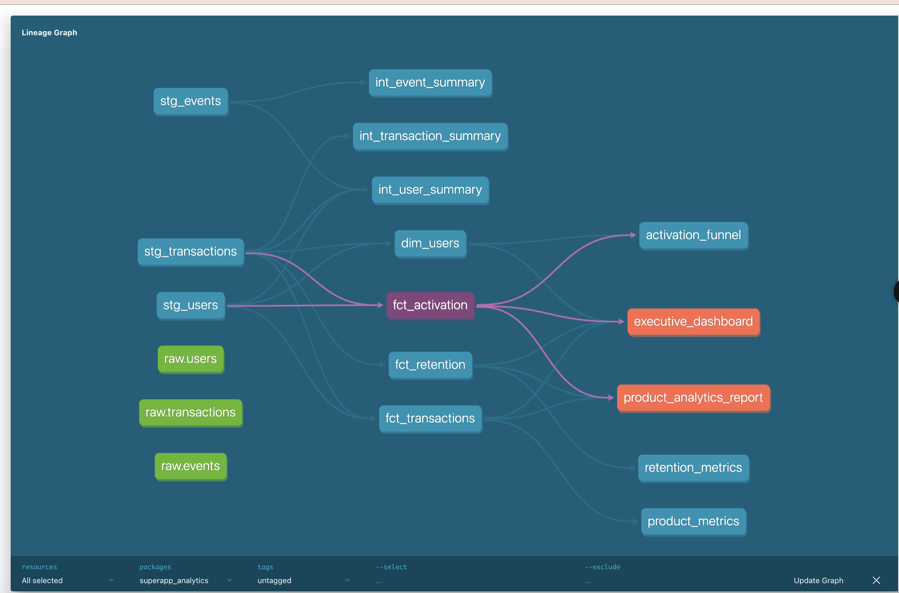

# 🚀 SuperApp Customer Lifecycle Analytics Platform

[](https://www.getdbt.com/)
[](https://duckdb.org/)

> Production-grade analytics platform processing **$68.2M GMV** across **224,614 transactions**



## 📊 Project Overview

Built a comprehensive customer lifecycle analytics system for a multi-product SuperApp (BNPL, Food Delivery, Ride Sharing, Gaming) using modern data stack principles.

### Key Metrics
- 💰 **$68.2M** Total GMV Processed
- 📈 **224,614** Transactions Analyzed
- 👥 Multi-product customer journey tracking
- 📉 Cohort-based retention analysis

## 🏗️ Architecture
```
Raw Data (CSV)
    ↓
Staging Layer (3 models)
    ├── stg_users
    ├── stg_transactions  
    └── stg_events
    ↓
Marts Layer (4 models)
    ├── dim_users (customer dimension)
    ├── fct_activation (first transaction analysis)
    ├── fct_transactions (transaction facts)
    └── fct_retention (cohort retention)
    ↓
Analyses (3 queries)
    ├── retention_metrics
    ├── product_metrics
    └── activation_funnel
```

## 📈 Key Models

### `dim_users` - Customer Dimension
Customer master with lifetime value metrics including total GMV, transaction count, and product adoption.

### `fct_activation` - Activation Analysis
Tracks first transaction by user and product, measuring time-to-activate and activation rates by segment.

### `fct_transactions` - Transaction Facts
Complete transaction history with customer context, payment status, and transaction sequencing.

### `fct_retention` - Retention Cohorts
Monthly cohort analysis tracking user retention over time by product.



## 🧪 Data Quality

**19 automated tests** ensuring data integrity:
- ✅ Primary key uniqueness
- ✅ Not-null constraints
- ✅ Accepted values validation
- ✅ Referential integrity checks


## 🚀 Quick Start

### Prerequisites
```bash
pip install dbt-duckdb
```

### Setup & Run
```bash
# Clone repository
git clone https://github.com/yourusername/superapp-lifecycle-analytics.git
cd superapp-lifecycle-analytics/dbt_project

# Install dependencies
dbt deps

# Run pipeline
dbt run

# Run tests
dbt test

# Generate documentation
dbt docs generate
dbt docs serve
```

## 📚 Documentation

Full lineage graph, column-level documentation, and metric definitions available via dbt Docs:
```bash
dbt docs serve
# Navigate to http://localhost:8080
```

## 🛠️ Tech Stack

- **Orchestration**: dbt Core 1.11.2
- **Database**: DuckDB (embedded analytics)
- **Version Control**: Git
- **Documentation**: dbt Docs
- **Testing**: dbt built-in data quality framework

## 💼 Business Value

✅ **Unified Customer View**: Single source of truth across all product lines  
✅ **Data Quality Automation**: 19 tests preventing bad data from reaching dashboards  
✅ **Self-Service Analytics**: Documented models enabling analyst independence  
✅ **Production-Ready**: Modular architecture supporting 200K+ transactions  

## 📊 Sample Analyses

### Retention Metrics
```sql
-- Monthly retention rates by cohort
SELECT 
    product,
    cohort_month,
    months_since_activation,
    retention_rate
FROM {{ ref('retention_metrics') }}
```

### Product Performance
```sql
-- GMV and transaction metrics by product
SELECT 
    product,
    total_gmv,
    total_users,
    gmv_per_user,
    transactions_per_user
FROM {{ ref('product_metrics') }}
```

## 🎯 Use Cases

1. **Activation Analysis**: Identify friction points in user onboarding
2. **Retention Tracking**: Monitor cohort health and churn patterns
3. **Cross-Product Usage**: Understand multi-product adoption journeys
4. **LTV Modeling**: Calculate customer lifetime value by segment

## 📁 Project Structure
```
dbt_project/
├── models/
│   ├── staging/           # Raw data standardization
│   │   ├── stg_users.sql
│   │   ├── stg_transactions.sql
│   │   └── stg_events.sql
│   ├── marts/             # Business logic layer
│   │   ├── dim_users.sql
│   │   ├── fct_activation.sql
│   │   ├── fct_transactions.sql
│   │   └── fct_retention.sql
│   └── exposures.yml      # Downstream dashboards
├── analyses/              # Ad-hoc queries
│   ├── retention_metrics.sql
│   ├── product_metrics.sql
│   └── activation_funnel.sql
├── tests/                 # Custom data tests
└── dbt_project.yml       # Project configuration
```

## 👩‍💻 About

**Fatima Farman**  
Product Analyst | BNPL & Fintech Analytics Specialist

- 3+ years in consumer fintech & BNPL
- Expertise: Customer lifecycle analytics, A/B testing, growth optimization
- Tech: SQL, Python, dbt, BigQuery, Tableau

📧 [Email](mailto:your.email@example.com) | 💼 [LinkedIn](https://linkedin.com/in/yourprofile) | 🌐 [Portfolio](https://yourportfolio.com)

---

⭐ **Star this repo** if you find it helpful!

Built with ❤️ using dbt + DuckDB
